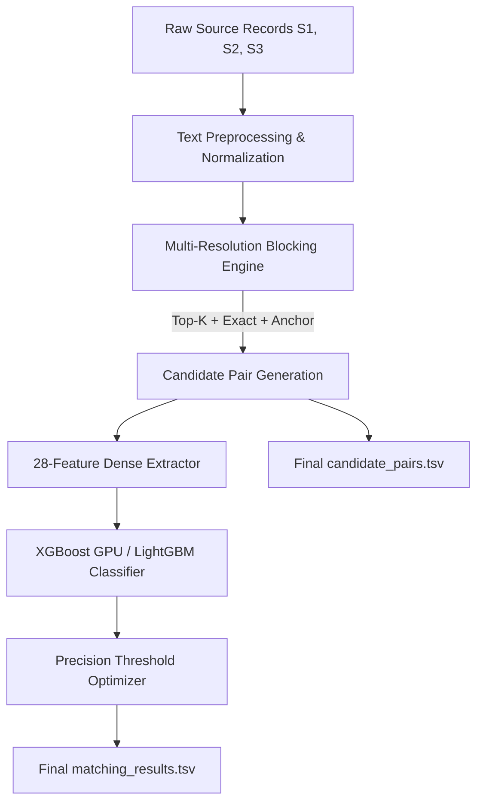

# 🏢 Business Semantics — Multi-Source Entity Resolution Pipeline

[](https://www.python.org/downloads/)
[](https://opensource.org/licenses/MIT)
[](https://developer.nvidia.com/cuda-toolkit)
[](https://xgboost.readthedocs.io/)

> **Amazon ML Challenge 2026**: High-precision, scalable multi-source business entity resolution across millions of noisy, fragmented records without shared identifiers.

---

## 📌 Executive Summary

Modern commercial platforms ingest merchant and business identity data from heterogeneous, noisy data sources ($S_1$, $S_2$, $S_3$). This repository implements an end-to-end, high-performance Entity Resolution pipeline optimized for **Macro-averaged $F_{0.5}$** (penalizing false positives $2\times$ heavier than false negatives):

* **Multi-Resolution Blocking**: Sub-linear candidate pruning with TF-IDF character $n$-grams + 4 auxiliary fast-path indices (exact name, compact name, rare-token inverted index, address anchor index).
* **28-Feature Dense Engineering**: Comprehensive phonetic, token-set, character 3-gram Jaccard, prefix containment, and numeric consistency features with zero external API dependencies.
* **GPU-Accelerated XGBoost / LightGBM**: Trained on over **11.7 million candidate pairs** across 220,682 entities with Optuna Bayesian hyperparameter optimization.
* **Precision-Calibrated Thresholding**: Fine-grained sweep targeting Macro $F_{0.5}$ and zero false merges on singletons.
* **Interactive Executive Dashboard**: FastAPI + Vanilla HTML/CSS/JS frontend with live entity matching sandbox, pipeline monitor, and benchmark runner.

---

## 🏆 Benchmark & Validation Results

Evaluated on held-out validation data ($N = 11,034$ entities / $584,136$ candidate pairs):

| Metric | Score / Value | Description |
| :--- | :---: | :--- |
| **Macro $F_{0.5}$** | **$0.9628$** | Official competition objective metric |
| **Macro Precision** | **$98.47\%$** | Near-zero false merge rate across business entities |
| **Macro Recall** | **$91.59\%$** | High coverage of true cross-source entities |
| **Singleton Accuracy** | **$95.54\%$** | Clean isolation of zero-match singletons |
| **Pairwise ROC AUC** | **$0.99974$** | Extreme discriminative separation between matches & non-matches |
| **Blocking Recall** | **$96.82\%$** | Search space reduction of $>99.98\%$ |

---

## 🏗️ System Architecture



### 1. Preprocessing & Multi-Channel Blocking
- Standardizes legal entities (`Corp`, `LLC`, `Pvt Ltd`, `Pte`), addresses, abbreviations, and punctuation.
- Generates character 3-grams for words $\ge 4$ characters to absorb OCR/transliteration typos.
- Extracts numeric anchors (`num_X`) to disambiguate branches, suite numbers, and zip codes.

### 2. 28-Dimensional Feature Extraction
- **Name Signals**: Fuzzy token sort ratio, token set ratio, partial ratio, character 3-gram Jaccard, first word match, prefix match, length ratio, token count diff.
- **Address Signals**: Fuzzy address ratio, token set ratio, address number exact match, length diff.
- **Structural Signals**: Strict numeric conflict flag, shared numeric count, blocking cosine score, blocking rank.

---

## 🚀 Quickstart Guide

### 1. Installation
```bash
git clone https://github.com/BhaveshBhardwaj/business-semantics.git
cd business-semantics/student_resource
pip install -r code/business_entity_resolution/requirements.txt
```

### 2. Model Training & Hyperparameter Tuning
Train the pairwise XGBoost model on GPU with Optuna Bayesian optimization:
```bash
# High-speed rapid training (~4 mins):
python code/business_entity_resolution/train_model.py --sample-entities 35000 --tune --n-trials 20 --clear-cache

# Full 10% slice training (~40 mins):
python code/business_entity_resolution/train_model.py --sample-frac 0.1 --max-cands 500000 --tune --n-trials 30 --clear-cache
```

### 3. Generate Submission Predictions
Run the test prediction pipeline over test entities:
```bash
python code/business_entity_resolution/main.py --test-dir dataset/test --output-dir output
```

### 4. Validate Submission Compliance
Ensure zero format violations or missing Source 1 entities:
```bash
python utils/validate_submission.py --matching output/matching_results.tsv --candidate output/candidate_pairs.tsv --test-dir dataset/test
```

### 5. Launch the Executive Dashboard
Run the local FastAPI server:
```bash
python frontend/server.py
```
Open **`http://127.0.0.1:8000`** in your browser.

---

## 📂 Repository Structure

```
business-semantics/
├── student_resource/
│   ├── code/
│   │   └── business_entity_resolution/
│   │       ├── models/                  # Trained model checkpoints & thresholds
│   │       │   ├── matching_xgb.json    # 28-feature XGBoost model checkpoint
│   │       │   ├── threshold.txt        # Calibrated decision threshold (0.958)
│   │       │   ├── training_metrics.txt # Full validation metrics log
│   │       │   └── best_xgb_params.json # Optuna tuned hyperparameter dictionary
│   │       ├── src/
│   │       │   ├── blocking.py          # TF-IDF & multi-channel blocking indices
│   │       │   ├── features.py          # 28-feature extraction functions
│   │       │   ├── preprocess.py        # Entity normalization & n-gram generation
│   │       │   └── pipeline.py          # Batch inference & streaming prediction
│   │       ├── main.py                  # CLI entrypoint for test prediction
│   │       ├── train_model.py           # Training pipeline with Optuna & streaming
│   │       └── requirements.txt         # Python dependencies
│   ├── frontend/                        # Interactive Web Studio
│   │   ├── server.py                    # FastAPI backend endpoints
│   │   └── static/                      # Light/Dark UI, app.js, styles.css
│   ├── utils/
│   │   └── validate_submission.py       # Official submission validator
│   ├── Documentation_template.md        # Technical methodology report
│   ├── OPTIMIZATION_SRS.md              # Software requirements specification
│   └── README.md                        # Problem statement guide
├── .gitignore
└── README.md
```

---

## 📄 License
This project is licensed under the MIT License.
